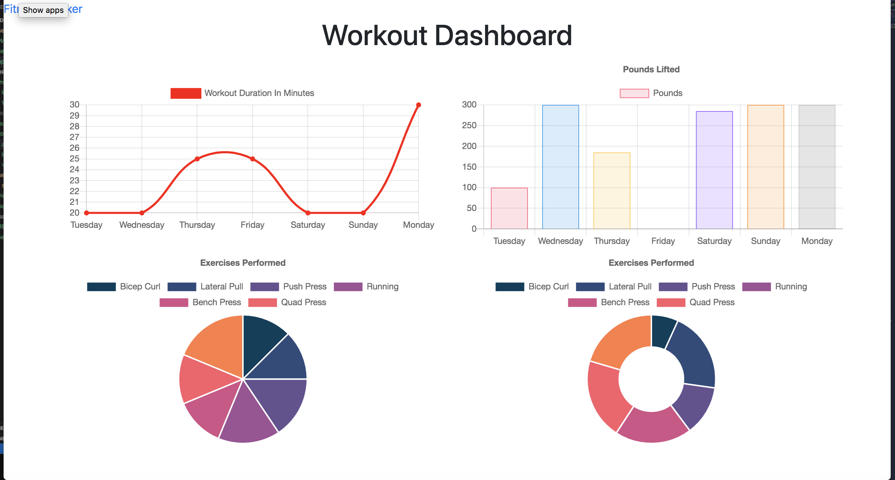

# workout-tracker

## Overview
This application was created for the user who is interested in being able to view, create and track their daily workouts. They will be able to log multiple exercises in a workout on any given day. They will be able to track the name, of said exercise, along with type, weight, sets, reps, and the duration. The app will also give the user the option if the exercise is cardio-based, where distance can be tracked.

## Index

* Installation

* Built with

* Dependencies

* Testing

* Questions

* Contact

## Installation:
npm install

## Built with:
- HTML
- CSS/ Bootstrap
- JavaScript
- Mongoose
- Express
- Morgan

## Dependencies:
express
mongoose
morgan

## Testing:
n/a

## Questions / Contact:
 If you have any questions please contact me at dobsonemily@gmail.com.  My Github is https://github.com/dobinator

### Still Image

### Heroku link:

https://fitness-tracker-emd.herokuapp.com/

